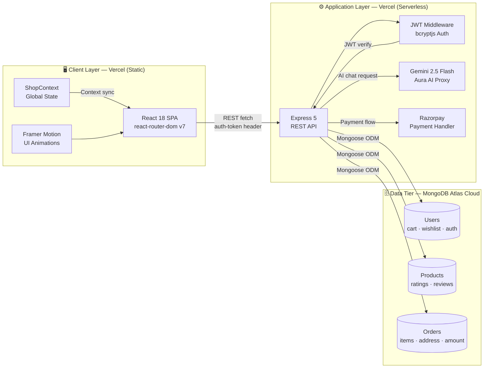

<div align="center">

<h1>🛍️ Explorer E-Commerce Platform</h1>

<p>A production-grade full-stack MERN storefront with AI-powered shopping assistance,<br/>secure payments, and real-time cart persistence.</p>

<br/>

<p>
  
  
  
  
  
  
  
  
</p>

</div>

---

## Table of Contents

- [Overview](#-overview)
- [Key Features](#-key-features)
- [System Architecture](#-system-architecture)
- [Project Structure](#-project-structure)
- [Tech Stack](#-tech-stack)
- [Local Setup](#-local-setup)
- [API Reference](#-api-reference)
- [Aura AI Implementation](#-aura-ai--implementation-notes)
- [Razorpay Checkout Flow](#-razorpay-checkout-flow)
- [License](#-license)

---

## 📌 Overview

**Explorer** is a modern, full-stack e-commerce application built on the MERN stack. It delivers a complete storefront experience — dynamic product catalog, persistent shopping cart, MongoDB-backed order history, wishlist management, and a Gemini-powered AI shopping assistant named **Aura**.

The architecture follows a clean monorepo pattern with isolated `frontend/` and `backend/` layers, each independently deployable on Vercel, backed by a MongoDB Atlas cloud database.

---

## ✨ Key Features

| | Feature | Description |
|--|---------|-------------|
| 🛒 | **Dynamic Product Catalog** | Category-filtered browsing across Men, Women, and Kids with size selection and live cart badge updates |
| 🔐 | **JWT Authentication** | Secure signup/login with `bcryptjs` password hashing and stateless JWT sessions stored in `localStorage` |
| 🛡️ | **Route Guarding** | Amazon/Flipkart-style access control — unauthenticated users are redirected to login before accessing `/cart` or `/checkout` |
| 🤖 | **Aura AI Assistant** | Gemini 2.5 Flash chatbot with live cart-context injection, multi-turn history, and a double try-catch fallback for zero-downtime responses |
| 💳 | **Razorpay Checkout** | Test-mode payment gateway with order ID generation, secure pipeline, and post-payment cart clearing |
| 📦 | **Persistent Cart & Wishlist** | Cart and wishlist stored per user in MongoDB — survives logout, re-login, and cross-device sessions |
| 📋 | **Live Orders History** | Authenticated `/api/orders` feed rendering records sorted by date with full address and item breakdown |
| 🌗 | **Dark / Light Mode** | Global theme context with instant toggle persisted across the session |
| 📱 | **Fully Responsive UI** | Mobile-first layouts across all viewports (320px → 1440px+) with hamburger drawer, collapsing search row, and fluid grid |
| ⭐ | **Product Reviews** | Per-product rating submissions with live average score recalculation on the backend |

---

## 🏗️ System Architecture



---

## 📁 Project Structure

```
explorer-ecommerce-platform/
├── .gitignore                       # Root-level unified ignore (covers both layers)
│
├── backend/
│   ├── db/db.js                     # MongoDB Atlas connection
│   ├── models/
│   │   ├── User.js                  # User schema — cart, wishlist, auth
│   │   ├── Product.js               # Product schema — ratings, reviews
│   │   └── Order.js                 # Order schema — items, address, amount
│   ├── routes/productRoutes.js      # Product CRUD endpoints
│   ├── upload/images/               # Static product image assets
│   ├── index.js                     # App entry — auth, cart, AI, order routes
│   └── .env                         # Backend secrets (never committed)
│
└── frontend/
    └── src/
        ├── App.js                   # Route definitions + auth guards
        ├── Context/
        │   ├── ShopContext.jsx      # Global state — cart, wishlist, products, search
        │   └── ThemeContext.jsx     # Dark / light mode
        ├── Components/
        │   ├── Navbar/              # Responsive navbar with mobile drawer
        │   ├── RufusAssistant/      # Aura AI chat interface
        │   ├── ProductDisplay/      # Product detail with size picker
        │   └── ...                  # Hero, Footer, Item, CartItems, etc.
        └── Pages/
            ├── Checkout.jsx         # Razorpay payment + order placement
            ├── MyOrders.jsx         # Authenticated order history
            ├── Wishlist.jsx         # Persisted wishlist view
            └── ...
```

---

## 🧰 Tech Stack

### Frontend

| Library | Version | Purpose |
|---------|---------|---------|
| React | 18.3 | UI framework |
| React Router DOM | v7 | Client-side routing + route guards |
| Framer Motion | 12.x | Animations and micro-interactions |
| React Markdown | 10.x | Renders Aura AI formatted responses |
| Vanilla CSS | — | Custom design system, no UI library |

### Backend

| Library | Version | Purpose |
|---------|---------|---------|
| Express | 5.x | REST API framework |
| Mongoose | 9.x | MongoDB ODM |
| jsonwebtoken | 9.x | JWT session tokens |
| bcryptjs | 3.x | Password hashing |
| @google/generative-ai | 0.24 | Gemini AI SDK |
| dotenv | 17.x | Environment variable management |
| cors | 2.x | Cross-origin request handling |

### Infrastructure

| Tool | Role |
|------|------|
| MongoDB Atlas | Cloud database |
| Vercel | Frontend static deployment |
| Vercel Serverless | Backend API deployment |
| Razorpay (test mode) | Payment gateway |
| Google Gemini 2.5 Flash | Aura AI model |

---

## 🚀 Local Setup

### Prerequisites

- Node.js ≥ 18.x
- MongoDB Atlas cluster URI
- Gemini API key — [Google AI Studio](https://aistudio.google.com/)
- Razorpay test key pair — [Razorpay Dashboard](https://dashboard.razorpay.com/)

### 1 · Clone

```bash
git clone https://github.com/Siddharth3011/explorer-ecommerce-platform.git
cd explorer-ecommerce-platform
```

### 2 · Install dependencies

```bash
# Backend
cd backend && npm install

# Frontend
cd ../frontend && npm install
```

### 3 · Environment variables

**`backend/.env`**
```env
MONGODB_URI=mongodb+srv://<username>:<password>@cluster0.xxxxx.mongodb.net/explorer?retryWrites=true&w=majority
JWT_SECRET=your_jwt_secret_key_here
GEMINI_API_KEY=your_gemini_api_key_here
CLIENT_URL=http://localhost:3000
PORT=5000
```

**`frontend/.env`**
```env
REACT_APP_BACKEND_URL=http://localhost:5000
REACT_APP_RAZORPAY_KEY_ID=rzp_test_your_key_id_here
```

> ⚠️ **Never commit `.env` files.** Both directories are covered by the root `.gitignore`.

### 4 · Run dev servers

```bash
# Terminal 1 — Backend
cd backend
npm start
# → http://localhost:5000

# Terminal 2 — Frontend
cd frontend
npm start
# → http://localhost:3000
```

---

## 🔌 API Reference

| Method | Endpoint | Auth | Description |
|--------|----------|:----:|-------------|
| `POST` | `/signup` | ✗ | Register a new user |
| `POST` | `/login` | ✗ | Authenticate and receive JWT |
| `POST` | `/getuser` | ✓ | Fetch authenticated user profile |
| `POST` | `/addtocart` | ✓ | Add item + size to cart |
| `POST` | `/removefromcart` | ✓ | Decrement or remove cart item |
| `POST` | `/getcart` | ✓ | Fetch full cart map |
| `POST` | `/addtowishlist` | ✓ | Add product to wishlist |
| `POST` | `/removefromwishlist` | ✓ | Remove product from wishlist |
| `POST` | `/getwishlist` | ✓ | Fetch full wishlist map |
| `POST` | `/placeorder` | ✓ | Save order + clear cart |
| `GET` | `/api/orders` | ✓ | Fetch user's order history |
| `POST` | `/api/ai/chat` | ✗ | Send message to Aura AI |
| `POST` | `/addreview` | ✗ | Submit a product rating + review |

> ✓ = requires `auth-token` header carrying a valid JWT

---

## 🤖 Aura AI — Implementation Notes

Aura runs as a backend proxy at `/api/ai/chat` using **Gemini 2.5 Flash**, keeping the API key fully server-side.

**Cart context injection** — Cart items are serialized and appended to the system instruction on every request, giving Aura real-time awareness of what the user is shopping for.

**Double try-catch fallback** — The primary path attempts a full multi-turn `startChat` session. If Gemini rejects the history format, a catch block immediately retries as a single-turn `generateContent` call, ensuring responses always arrive with no visible error to the user.

**Role normalization** — Chat history is mapped from the frontend's `{ role, content }` format to Gemini's `{ role, parts: [{ text }] }` schema before transmission.

---

## 💳 Razorpay Checkout Flow

```
User clicks "Proceed to Pay"
        │
        ▼
Frontend POSTs to Razorpay Orders API  ──→  receives order_id
        │
        ▼
Razorpay payment modal opens (test mode)
        │
        ▼
On payment success  ──→  Frontend POSTs /placeorder to backend
        │
        ▼
Backend saves Order document to MongoDB  +  clears user cartData
        │
        ▼
User redirected to /orders  ──→  live order confirmation rendered
```

---

## 📄 License

This project is for portfolio and educational purposes. All product images are used under fair use for demonstration.

---

<div align="center">

Built with ☕ by **Siddharth Pandey**

[](https://github.com/Siddharth3011)

</div>
